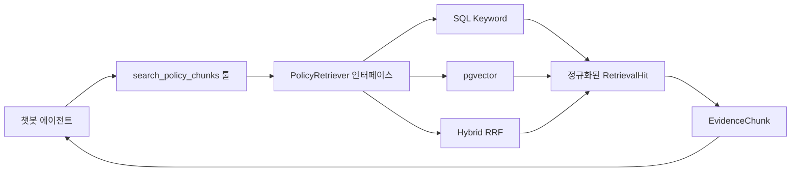

# 정책 챗봇 리트리버 정량 평가 포트폴리오

## 한 줄 요약

정책 챗봇의 검색 로직을 교체 가능한 리트리버 계층으로 분리하고,
50문항 골드셋으로 PostgreSQL 키워드 검색, pgvector 의미 검색,
RRF 하이브리드 검색을 동일 조건에서 비교해 pgvector를 기본 전략으로
선정했다.

## 문제

기존 챗봇은 검색 구현과 툴 호출이 강하게 연결돼 있어 검색 방식을 바꾸거나
성능을 비교하기 어려웠다. 또한 “벡터 검색이 더 좋다”는 판단을 뒷받침할
정량 지표와 재현 가능한 평가 데이터가 없었다.

이번 작업의 목표는 다음과 같다.

- 에이전트의 툴 호출 계약을 유지하면서 검색 구현을 교체 가능하게 만들기
- 일반 RDBMS 키워드 조회와 벡터·하이브리드 검색을 같은 문항으로 비교하기
- 검색 성공 여부뿐 아니라 올바른 근거 섹션과 검색 순위까지 측정하기
- 측정 결과를 바탕으로 운영 기본 전략을 선택하기

## 구현

### 1. 리트리버 계층

`PolicyRetriever` 프로토콜과 공통 `RetrievalHit` 모델을 도입했다.
에이전트는 기존처럼 `search_policy_chunks` 툴을 호출하고, 툴 내부에서
선택한 리트리버가 실제 검색을 수행한다.



이 구조에서는 에이전트의 판단 책임과 검색 알고리즘의 책임이 분리된다.
새 검색 전략을 추가할 때 에이전트 프롬프트나 툴 응답 계약을 바꿀 필요가
없다.

### 2. 세 가지 검색 전략

| 전략 | 구현 | 비교 목적 |
|---|---|---|
| SQL keyword | PostgreSQL `ILIKE` 기반 부분문자열 일치율 | 의미 검색이 없는 RDBMS 기준선 |
| Vector | `text-embedding-3-large` 임베딩과 pgvector 코사인 거리 | 사용자 표현과 원문 표현이 다른 의미 검색 |
| Hybrid | 두 채널의 후보를 병렬 조회하고 RRF로 결합 | 키워드와 의미 검색의 상호 보완 가능성 |

여기서 “RDBMS 대 벡터 DB”로 표현하면 정확하지 않다. 세 방식 모두
PostgreSQL의 정책 청크를 조회하며, 차이는 일반 문자열 조건 검색과
pgvector 확장을 이용한 의미 검색, 그리고 두 결과의 결합 방식이다.

하이브리드는 각 채널에서 `top_k × 2`개 후보를 가져온 뒤 다음 RRF 점수를
청크별로 합산한다.

```text
RRF score = Σ 1 / (60 + rank)
```

### 3. 50문항 골드셋

- 전체 50문항, 10개 정책을 기준으로 정책별 5문항 구성
- 질문 유형: 지원 대상 15, 지원 내용 21, 신청 방법 10, 유의사항 4
- 정책명을 질문에 직접 노출하지 않고 사용자 상황과 구어체로 변환
- 48문항은 단일 정답, 의미상 두 정책이 모두 가능한 2문항은 복수 정답
- 각 문항에 정답 정책 ID와 기대 근거 섹션을 함께 라벨링

모든 문항은 정책 원문과 세 검색 방식의 상위 후보를 대조해 전수 검수했다.
문장 모호성, 대체 정답, 근거 섹션, 정책명 노출, 자연스러움, 의미 중복을
확인했으며 판정 근거는 별도 문서에 남겼다.

## 평가 방법

동일한 50문항과 `Top K = 5` 조건에서 다음 지표를 측정했다.

| 지표 | 의미 |
|---|---|
| Policy Hit@5 | 상위 5개 청크에 허용 정답 정책이 하나 이상 포함된 문항 비율 |
| Section Hit@5 | 정답 정책의 기대 근거 섹션까지 포함된 문항 비율 |
| MRR | 정답 정책이 처음 등장한 순위의 역수 평균 |
| p50 / p95 latency | 문항별 검색 지연시간의 중앙값과 95백분위 |
| Error rate | 검색 중 예외가 발생한 문항 비율 |

복수 정답 문항은 검수된 정책 중 하나가 검색되면 정답으로 처리한다.
평가기에는 빈 정답, 중복 정답 ID, 중복 문항 ID를 거부하는 검증도
포함했다.

## 결과

실행일은 2026년 7월 28일이며, 아래 수치는 50문항 1회 실행 결과다.

| 방식 | Policy Hit@5 | Section Hit@5 | MRR | p50 | p95 | Error |
|---|---:|---:|---:|---:|---:|---:|
| SQL keyword | 18.0% | 12.0% | 0.0957 | 1,293ms | 1,789ms | 0.0% |
| pgvector | **86.0%** | **78.0%** | **0.7497** | **747ms** | **1,070ms** | 0.0% |
| Hybrid RRF | **86.0%** | **78.0%** | 0.6840 | 1,305ms | 1,825ms | 0.0% |

pgvector는 SQL 키워드 기준선보다 Policy Hit@5가 **68%p**,
Section Hit@5가 **66%p** 높았다. 하이브리드는 Hit@5가 pgvector와
같았지만 MRR이 0.0657 낮고 p50 지연시간이 약 558ms 길었다.

따라서 현재 데이터와 결합 규칙에서는 pgvector 단독을 기본 전략으로
유지하는 것이 타당하다. SQL 키워드 검색의 일반 단어 노이즈가 RRF 결과에
유입돼 하이브리드의 추가 이득이 나타나지 않은 것으로 해석했다.

## 이력서에 사용할 수 있는 문장

### 한 줄 버전

> 정책 챗봇에 교체 가능한 리트리버 계층과 50문항 정량 평가 체계를 구축하고, PostgreSQL 키워드·pgvector·RRF 하이브리드 검색을 비교해 pgvector의 Policy Hit@5를 18%에서 86%로 68%p 개선

### 두 줄 버전

> 에이전트의 툴 계약과 검색 구현을 분리한 `PolicyRetriever` 계층을 설계하고 SQL 키워드, pgvector, RRF 하이브리드 전략을 동일 인터페이스로 구현  
> 정책명 노출을 제거한 50문항 골드셋과 Policy/Section Hit@5·MRR·지연시간 평가기를 구축해 pgvector를 운영 기본값으로 선정

### 담당 업무 중심 버전

> 정책 원문과 검색 후보를 기준으로 50문항 골드셋을 전수 검수하고 복수 정답 라벨을 지원하는 평가기를 구현했으며, 검색 정확도뿐 아니라 근거 섹션 적중률과 순위 품질까지 회귀 검증 가능하도록 자동화

## 면접에서 설명할 핵심

### 왜 Hit Rate만 보지 않았는가?

정답 정책이 5위 안에 포함돼도 답변에 필요한 지원 대상·지원 내용·신청
방법 섹션이 없으면 근거로 쓰기 어렵다. 그래서 정책 단위 Hit@5와 함께
근거 섹션 단위 Hit@5를 측정했다. MRR은 같은 Hit@5 안에서도 정답을 더
앞 순위에 배치하는 전략을 구분한다.

### 왜 하이브리드가 벡터보다 좋지 않았는가?

현재 SQL 기준선은 형태소 분석이나 필드 가중치가 없는 부분문자열
검색이다. 긴 문서의 일반 단어 일치가 높은 순위를 차지하면서 RRF에
노이즈가 합쳐졌다. 하이브리드라는 구조 자체가 항상 더 좋은 것이 아니라,
각 검색 채널의 품질과 결합 가중치를 데이터로 검증해야 한다.

### 에이전트가 직접 검색 전략을 선택하는가?

아니다. 에이전트는 정책 근거가 필요할 때 검색 툴을 호출한다. 검색 전략은
툴 내부의 리트리버 팩토리에서 결정되므로, LLM의 비결정적 판단과 검색
알고리즘 선택을 분리했다.

### 골드셋을 어떻게 신뢰할 수 있는가?

정책명을 그대로 포함한 질문은 회귀 테스트로 차단했다. 모든 문항을 정책
원문 및 오검색 후보와 대조하고, 다른 정책도 답이 될 수 있는 두 문항은
복수 정답으로 수정했다. 다만 이는 내부 AI 기반 검수이며 외부 평가자 간
일치도를 측정한 독립적인 사람 검수는 아니다.

## 해석 범위와 다음 단계

- 현재 지연시간은 한 번의 실행 결과이므로, 성능 수치로 강조하려면 워밍업
  후 3회 이상 반복한 중앙값과 분산을 추가해야 한다.
- 정책과 문항 범위가 제한된 내부 골드셋이므로 전체 복지정책 도메인의
  일반화 성능을 의미하지 않는다.
- 현재 평가는 리트리버가 올바른 근거를 찾는지 측정한다. 생성 답변이
  근거에 충실한지를 뜻하는 **faithfulness는 아직 측정하지 않았다.**
- 다음 단계에서는 같은 50문항에 정답 답변 또는 원자적 사실 목록을
  추가하고, 생성 답변의 각 주장이 검색 근거로 뒷받침되는 비율을 별도
  평가해야 한다.
- 하이브리드는 한국어 토큰화, 정책 상세 청크 가중치, 검색 채널별 가중
  RRF를 적용한 뒤 동일 골드셋으로 다시 비교할 수 있다.

## 재현 자료

- 리트리버 구현: `app/ai/retrievers/policy_retriever.py`
- 챗봇 검색 툴: `app/ai/tools/policy_chunk_search_tool.py`
- 평가기: `tests/eval/retrieval_eval.py`
- 50문항 골드셋: `tests/eval/retrieval_cases.jsonl`
- 전수 검수 기록: `docs/RETRIEVAL_GOLDSET_AUDIT.md`
- 상세 결과: `docs/RETRIEVAL_BENCHMARK.md`
- 원본 실행 결과: `output/retrieval_benchmark_50.json`

```bash
PYTHONPATH=. .venv/bin/python tests/eval/retrieval_eval.py \
  --top-k 5 \
  --output output/retrieval_benchmark_50.json
```
