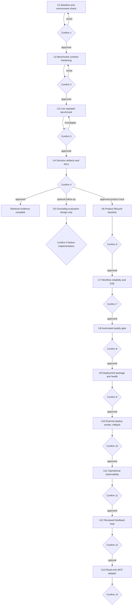

# plan: Build Dodam end-to-end AI product lifecycle

## Summary

Dodam을 검색 실험에 머무르지 않고 사용자 요청, LangGraph 기반 처리, 근거 있는 응답, request lifecycle 복구, 품질 gate, 배포, 관측, 피드백 환류까지 연결된 대표 AI 제품 사례로 강화한다. 검색 반복평가 U1~U4와 생성 근거 평가 U5의 측정 무결성은 유지하고, 제품화 작업은 U6부터 별도 승인 단위로 수행한다.

현재 저장소에는 50문항 골드셋, SQL keyword/vector/hybrid/adaptive 비교, fallback 사례 분류, 검색 근거 correctness, 반복 실행 옵션뿐 아니라 사용자용 프론트, SSE, 추천·자격판정 request lifecycle, DB 저장, stale processing 복구가 있다. 기존 기능을 다시 만들지 않고 검색 근거를 확정한 뒤, 실제 사용자 경로의 복구 가능성 및 release gate를 먼저 고정하고 배포·운영 계층을 추가한다.

---

## Working Agreement

이 문서를 읽고 작업하는 사람 또는 에이전트는 다음 규칙을 지킨다.

1. 한 번에 하나의 승인 단위만 수행한다.
2. 승인 단위에 적힌 허용 범위 밖의 파일은 수정하지 않는다.
3. 작업 중 범위 확대가 필요하면 구현하지 말고 이유와 선택지를 먼저 보고한다.
4. 각 승인 단위가 끝나면 `Confirmation Report` 형식으로 결과를 보고하고 멈춘다.
5. 사용자가 `승인`, `진행`, 또는 다음 승인 단위를 명시하기 전에는 다음 작업을 시작하지 않는다.
6. 실제 실행에 실패했으면 fixture나 과거 수치로 성공을 대신하지 않는다.
7. 검색 평가와 생성 답변 평가는 분리한다. `retrieved_evidence_correctness`를 답변 faithfulness로 표현하지 않는다.
8. 기존 benchmark 파일을 보존한다. 새 실행은 별도 출력 파일에 저장하고, 채택 승인을 받은 뒤에만 대표 문서를 갱신한다.
9. API key, DB URL, 사용자 정보 등 비밀값은 로그, 문서, JSON 산출물에 기록하지 않는다.
10. 팀 구현, 개인 후속 평가, 아직 실행하지 않은 계획을 결과 보고에서 구분한다.
11. backend와 frontend는 별도 Git 저장소다. 두 저장소 변경이 필요한 단위는 각각의 변경 범위와 검증 결과를 분리해 보고한다.
12. 배포 파일의 존재, 로컬 실행, 실제 외부 배포를 서로 다른 상태로 기록한다.
13. 사용자 피드백은 자동으로 정답이나 학습 데이터가 되지 않는다. 검토 전에는 평가 후보로만 저장한다.

처음 이 문서를 읽었다면 U1만 수행한다. U1 결과를 보고하기 전에는 U2의 코드 변경을 시작하지 않는다.

---

## Current Baseline

작업 시작 시 아래 항목을 현재 저장소에서 다시 확인한다. 이 목록은 2026-08-16까지의 관찰값이며, 현재 상태를 대신하지 않는다.

- 검색 진입점: `app/ai/retrievers/policy_retriever.py`
- 평가 실행기: `tests/eval/retrieval_eval.py`
- 골드셋: `tests/eval/retrieval_cases.jsonl`
- 평가 단위 테스트: `tests/eval/test_retrieval_eval.py`
- 포트폴리오 근거 생성기: `tests/eval/retrieval_portfolio_evidence.py`
- 근거 생성기 테스트: `tests/eval/test_retrieval_portfolio_evidence.py`
- 단일 실행 결과: `output/retrieval_benchmark_50.json`
- 정책 범위 실행 결과: `output/retrieval_benchmark_scoped_50.json`
- 반복 latency 현황: `output/retrieval_latency_repeated.json`은 실제 반복 실행이 아닌 fixture이며 `actual_repeated_run_available=false`로 표시돼 있다.
- 대표 설명 문서: `docs/RETRIEVAL_BENCHMARK.md`, `docs/PORTFOLIO_RETRIEVAL_EVIDENCE.md`, `docs/RESUME_RETRIEVAL_EVALUATION.md`
- backend 사용자 흐름: `app/api/ai_request_controller.py`, `app/api/chat_controller.py`
- request lifecycle: `app/services/ai_request_lifecycle_service.py`, `app/repositories/chat_request_repository.py`
- 중앙 AI 흐름: `app/ai/graphs/recommendation_graph.py`, `app/services/chat/chat_service.py`
- frontend 연결: `../front/apis/recommendationApi.js`, `../front/apis/chatApi.js`, `../front/apis/sseStreamClient.js`
- 복구 기준선: startup에서 stale chat request를 FAILED로 전환하며 관련 테스트가 존재한다.
- 배포 기준선: 2026-08-16 점검에서는 backend test CI workflow, Dockerfile/Compose, health/readiness endpoint를 확인하지 못했다. U6에서 현재 상태를 다시 검증한다.

현재 문서화된 단일 실행 결과는 다음과 같다. 이 수치는 실제 반복 실행으로 재검증하기 전까지 과거 기준선이다.

| 조건 | 전략 | Policy Hit@5 | Section Hit@5 | p50 | p95 | Fallback |
|---|---|---:|---:|---:|---:|---:|
| Broad | Vector | 86.0% | 80.0% | 782ms | 1,093ms | - |
| Broad | Hybrid | 88.0% | 80.0% | 1,292ms | 1,717ms | - |
| Broad | Adaptive | 86.0% | 80.0% | 809ms | 2,290ms | 14.0% |
| Scoped | Vector | 100.0% | 98.0% | 665ms | 1,027ms | - |
| Scoped | Adaptive | 100.0% | 98.0% | 700ms | 951ms | 2.0% |

---

## Requirements

### Measurement Integrity

- R1. 실제 반복 실행과 fixture 기반 산출물을 JSON 필드와 문서 표현에서 명확히 구분한다.
- R2. 반복 벤치마크는 동일한 골드셋, `top_k=5`, 전략 목록, 실행 횟수, warm-up 횟수를 기록한다.
- R3. 각 전략의 실행별 Policy Hit@5, Section Hit@5, MRR, p50, p95, error rate, fallback 정보를 보존한다.
- R4. 대표 latency는 실행별 p50/p95의 중앙값으로 요약하되 실행별 값도 삭제하지 않는다.
- R5. 검색 결과의 정확도 회귀와 latency 변동을 분리해 해석한다.

### Approval Control

- R6. 승인 단위 종료 시 변경 파일, 검증 결과, 수치, 트레이드오프, 한계, 다음 범위를 보고한다.
- R7. 에러 발생, 골드셋 변경, 예상하지 못한 정확도 변화가 있으면 문서 갱신 전에 멈춘다.
- R8. 승인받지 않은 생성 품질 평가, API 응답 계약 변경, 리트리버 튜닝은 수행하지 않는다.

### Portfolio Claims

- R9. 실제 반복 실행이 성공한 수치만 반복 benchmark 결과로 승격한다.
- R10. 내부 50문항 검색 검증셋이라는 범위와 외부 표준 벤치마크가 아니라는 한계를 유지한다.
- R11. 검색된 근거의 적중 여부와 생성 답변의 faithfulness를 같은 지표로 합치지 않는다.
- R12. Hybrid와 Adaptive의 선택은 정확도, latency, fallback 호출 비용을 함께 보고 결정한다.

### Product Lifecycle

- R13. 사용자 입력부터 frontend, API, request state, LangGraph/service, DB result, 사용자 표시까지 하나의 correlation/request ID로 추적 가능한 계약을 만든다.
- R14. 중복 제출, SSE disconnect, process restart, stale processing, LLM/embedding 실패가 무한 처리 또는 조용한 성공으로 남지 않아야 한다.
- R15. deterministic fallback과 AI 결과를 응답, 로그, 평가 산출물에서 구분한다.
- R16. PR gate는 외부 유료 호출 없이 결정론적으로 실행하고, live retrieval/generation 평가는 수동 또는 scheduled gate로 분리한다.
- R17. backend, frontend, DB migration의 build와 시작 순서, secret 주입, health/readiness 조건을 재현 가능하게 문서화한다.
- R18. 실제 배포 완료는 외부 URL, 배포 revision, smoke 결과, rollback 절차가 함께 확인된 경우에만 선언한다.
- R19. 운영 관측은 request 수, 완료/실패/복구 상태, stage latency, fallback, 외부 dependency error를 수집하되 질문 원문과 개인정보를 기본 label로 사용하지 않는다.
- R20. 사용자 피드백은 request/result/evidence version과 연결하고 검토 후에만 회귀평가 case 후보로 승격한다.
- R21. MCP는 검증된 검색·근거 조회 기능의 read-only adapter로만 추가하며 검색 또는 Agent 로직을 복제하지 않는다.

---

## Scope Boundaries

### In Scope

- 반복 벤치마크 출력 계약 보강
- warm-up을 제외한 실제 5회 측정
- Broad 4전략 및 Scoped 2전략 결과 생성
- 반복 결과 기반 전략 선택 근거 갱신
- 승인된 수치의 검색 평가 및 포트폴리오 문서 반영
- 별도 승인 후 수행하는 소규모 생성 근거 연결 평가 설계
- 사용자 요청부터 결과 표시까지 lifecycle 및 소유 경계 감사
- request idempotency, disconnect/restart recovery, failure 상태 검증
- backend/frontend 결정론적 CI와 별도 live AI quality gate
- 재현 가능한 container build, migration, health/readiness 계약
- 승인된 한 환경의 실제 배포, smoke, rollback 검증
- 개인정보를 제외한 운영 metric과 사용자 피드백 환류 계약
- 안정된 검색 API 이후 선택적으로 추가하는 read-only MCP adapter

### Deferred Until Separate Approval

- 생성 답변과 evidence chunk의 연결 방식 변경
- `evidence` 문자열을 chunk ID 또는 source object로 바꾸는 API 계약 변경
- LLM judge 도입
- 골드셋 확대 또는 외부 평가자 일치도 측정
- 검색 전략 파라미터 재튜닝
- 공개 배포 환경과 비용 한도를 정하기 전 특정 cloud provider 고정
- 자동 재학습 또는 사용자 피드백의 무검토 goldset 편입
- write-capable MCP tool과 외부 시스템 변경 권한

### Out of Scope

- 제품화와 무관한 LangGraph 노드 또는 Agent 수 증가
- 운영 SLA 선언
- 공개 표준 벤치마크라는 표현
- 새 vector database 또는 검색 프레임워크 도입
- multi-cloud, autoscaling, service mesh, production SRE 경험 과장

---

## High-Level Flow



---

## Key Technical Decisions

- KTD1. **실측 전에 측정 계약부터 고정한다:** 현재 반복 실행 옵션은 있지만 warm-up과 실제 실행 provenance가 출력 계약에 충분히 드러나지 않는다. 비용이 큰 5회 실행 전에 이를 테스트로 잠근다.
- KTD2. **Broad와 Scoped를 별도 산출물로 유지한다:** Broad는 정책 발견 능력, Scoped는 이미 선택된 정책 안에서 근거 섹션을 찾는 능력을 본다. 두 조건의 수치를 합치지 않는다.
- KTD3. **대표값과 원시 실행값을 함께 보존한다:** 중앙값만 남기면 변동성과 이상치를 검토할 수 없다. 요약값은 비교에 쓰고 실행별 값은 감사 근거로 남긴다.
- KTD4. **정확도 회귀는 자동 튜닝의 신호가 아니라 중단 신호다:** 반복 실행에서 과거 기준선과 차이가 나면 데이터, DB 상태, 코드, 모델 설정을 먼저 확인한다.
- KTD5. **생성 근거 연결 평가는 별도 결정으로 둔다:** 현재 API는 사용자 친화적인 evidence 문자열을 반환하며 chunk ID 직접 인용 계약이 아니다. 이를 강화하면 소비자 계약에 영향이 있으므로 검색 보강과 한 작업으로 묶지 않는다.
- KTD6. **도담이 제품 전체 사이클을 담당한다:** ForgeAI는 실험·안전성 검증에 집중하고, 자동화부터 실제 배포와 피드백 환류까지의 대표 근거는 도담에서 만든다.
- KTD7. **인프라보다 사용자 lifecycle을 먼저 잠근다:** container와 cloud 배포 전에 중복 요청, disconnect, restart, failure 복구를 E2E로 검증한다.
- KTD8. **품질 gate를 두 층으로 나눈다:** PR에서는 deterministic test와 stored fixture 회귀를 실행하고, 비용·변동성이 있는 live 평가는 scheduled/manual gate로 운영한다.
- KTD9. **배포 대상은 U6에서 선택한다:** 무료 한도, PostgreSQL, secret, frontend/backend 분리, 운영 기간을 비교하기 전 provider를 계획에 고정하지 않는다.
- KTD10. **피드백은 관측값이다:** 사용자 평가는 유용하지만 정답이 아니므로 evidence version과 함께 검토 대기 상태로 축적한다.
- KTD11. **MCP는 제품 API가 안정된 뒤 추가한다:** 포트폴리오용 기능 수를 늘리기 위해 별도 검색 로직이나 write tool을 만들지 않는다.

---

## Implementation Units

### U1. Baseline and environment check

- **Goal:** 코드 수정 없이 실제 반복 실행이 가능한 상태와 현재 기준선을 확정한다.
- **Allowed changes:** 없음. 환경 파일이나 benchmark JSON을 수정하지 않는다.
- **Inspect:** `README.md`, `.env.example`, `requirements.txt`, `tests/eval/retrieval_eval.py`, 기존 `output/retrieval_benchmark_*.json`.
- **Actions:**
  - 현재 브랜치, HEAD, 작업 트리 상태를 기록한다.
  - Python 3.12 가상환경과 필수 패키지 사용 가능 여부를 확인한다.
  - DB 연결과 임베딩 API 설정 여부를 값 노출 없이 확인한다.
  - 3개 case와 `vector` 전략으로 smoke benchmark를 수행한다. 결과는 임시 경로에 두며 대표 산출물을 덮어쓰지 않는다.
  - 평가 단위 테스트를 실행해 현재 계약이 통과하는지 확인한다.
- **Verification:**
  - `tests/eval/test_retrieval_eval.py`
  - `tests/eval/test_retrieval_portfolio_evidence.py`
  - smoke benchmark 3문항 완료, error rate 0%
- **Commands:**

  ```bash
  PYTHONPATH=. .venv/bin/pytest -q \
    tests/eval/test_retrieval_eval.py \
    tests/eval/test_retrieval_portfolio_evidence.py

  PYTHONPATH=. .venv/bin/python tests/eval/retrieval_eval.py \
    --strategies vector \
    --ids R001 R002 R003 \
    --top-k 5 \
    --output /tmp/dodam-retrieval-smoke.json
  ```

  `.venv`가 없으면 임의로 새 dependency 환경을 만들지 말고 U1 보고에서 중단 사유와 저장소의 실제 Python 실행 경로를 제시한다.
- **Stop conditions:**
  - DB 또는 임베딩 API에 연결할 수 없음
  - 골드셋이 50문항이 아니거나 policy ID 구성이 달라짐
  - 기존 평가 테스트 실패
  - smoke benchmark에 에러 발생
- **Confirmation 1 report focus:** 환경 준비 여부, 실제 실행 비용이 발생하는 외부 호출 범위, 현재 실패 요인, U2 진행 가능 여부.

### U2. Benchmark contract hardening

- **Depends on:** Confirmation 1 approval.
- **Goal:** warm-up과 실제 반복 실행 여부가 산출물에서 모호하지 않도록 평가 출력 계약을 보강한다. 실제 5회 전체 평가는 아직 실행하지 않는다.
- **Files:**
  - `tests/eval/retrieval_eval.py`
  - `tests/eval/test_retrieval_eval.py`
  - `docs/RETRIEVAL_BENCHMARK.md`
- **Approach:**
  - warm-up 횟수를 명시할 수 있는 입력을 추가하고 warm-up 결과는 집계 대상에서 제외한다.
  - 반복 결과에 `execution_mode`, `run_count`, `warmup_run_count`, 검색 조건을 기록한다.
  - 실행별 metric 배열과 중앙값 요약을 계속 보존한다.
  - 비밀값, 전체 환경 변수, DB 접속 문자열은 provenance에 넣지 않는다.
  - `repeat_runs=1`, 잘못된 횟수, warm-up 포함/제외 동작을 테스트한다.
- **Test Scenarios:**
  1. warm-up 1회와 측정 3회를 요청하면 검색은 총 4회 실행되지만 요약의 `run_count`는 3이다.
  2. `warmup_run_count`는 출력에 남고 warm-up latency는 대표값 계산에 포함되지 않는다.
  3. 2회 이상 실행 결과에는 실행별 p50/p95 배열과 중앙값이 함께 존재한다.
  4. 1회 실행의 기존 결과 shape는 기존 소비자가 읽을 수 있도록 유지하거나 변경점을 문서화한다.
  5. 음수 warm-up 또는 0 이하 repeat 횟수는 명확한 오류로 종료한다.
- **Verification:** 관련 pytest 전체 통과, 3문항 fake 또는 smoke run으로 JSON schema 확인.
- **Tradeoff to report:** 출력 schema 하위 호환성을 유지할지, 반복 실행 결과에만 새 metadata를 둘지. 구현 결과와 소비자 영향을 함께 보고한다.
- **Stop conditions:** 기존 benchmark reader나 근거 생성기가 깨짐, 실제 실행과 fixture를 구분할 수 없음, 테스트 없이 CLI 동작만 추가됨.
- **Confirmation 2 report focus:** 변경된 출력 예시, 하위 호환성, 테스트 결과, 전체 실행 예상 호출량과 시간, U3 명령과 출력 경로.

### U3. Live repeated benchmark

- **Depends on:** Confirmation 2 approval.
- **Goal:** fixture가 아닌 실제 반복 benchmark를 Broad와 Scoped 조건에서 생성한다.
- **Allowed changes:** 결과 JSON만 생성한다. 리트리버 로직, 골드셋, 평가 계산식, 대표 문서는 수정하지 않는다.
- **Outputs:**
  - `output/retrieval_benchmark_repeated_broad_5.json`
  - `output/retrieval_benchmark_repeated_scoped_5.json`
- **Run Contract:**
  - 골드셋 50문항
  - `top_k=5`
  - warm-up 1회, 측정 5회
  - Broad: `sql_keyword`, `vector`, `hybrid`, `adaptive`
  - Scoped: `vector`, `adaptive`
  - 전략 실행 순서는 결과에 기록하거나 보고서에 명시한다.
- **Commands after U2 approval:** U2에서 확정한 warm-up flag 이름이 `--warmup-runs`인 경우 아래 명령을 사용한다. 실제 flag가 다르면 Confirmation 2에서 확정한 명령을 우선한다.

  ```bash
  PYTHONPATH=. .venv/bin/python tests/eval/retrieval_eval.py \
    --strategies sql_keyword vector hybrid adaptive \
    --warmup-runs 1 \
    --repeat-runs 5 \
    --top-k 5 \
    --output output/retrieval_benchmark_repeated_broad_5.json

  PYTHONPATH=. .venv/bin/python tests/eval/retrieval_eval.py \
    --strategies vector adaptive \
    --scope-to-expected-policy \
    --warmup-runs 1 \
    --repeat-runs 5 \
    --top-k 5 \
    --output output/retrieval_benchmark_repeated_scoped_5.json
  ```
- **Acceptance Criteria:**
  - 두 실행 모두 측정 5회를 완주한다.
  - error rate가 모든 전략에서 0%다.
  - JSON에 실행별 metric과 중앙값 요약이 모두 존재한다.
  - Adaptive fallback count/rate가 실행별로 보존된다.
  - 기존 단일 실행 결과 파일은 변경되지 않는다.
- **Regression Alert:** 다음 항목은 실패로 단정하지 않고 조사 필요 상태로 보고한 뒤 멈춘다.
  - Policy Hit@5 또는 Section Hit@5가 과거 기준선과 2%p 초과 차이
  - 같은 코드와 데이터에서 실행별 정확도 값이 달라짐
  - error rate가 0%보다 큼
  - 특정 실행의 p95가 중앙 p95의 2배를 초과
  - fallback rate가 실행별로 달라짐
- **Confirmation 3 report focus:**
  - 전략별 정확도와 실행별 p50/p95
  - median, min, max와 이상치
  - fallback 횟수와 실패 case
  - 과거 단일 실행 대비 차이
  - Hybrid의 소폭 정확도 이득과 추가 latency
  - Adaptive의 조건부 SQL 호출 절감과 tail latency 비용
  - 결과를 대표 수치로 채택할지, 재실행 또는 원인 조사가 필요한지

### U4. Decision artifacts and documentation

- **Depends on:** Confirmation 3에서 실측 결과 채택 승인.
- **Goal:** 승인된 실측값만 자동 산출물과 대표 문서에 반영하고, 포트폴리오에서 사용할 수 있는 제한된 결론을 만든다.
- **Files:**
  - `tests/eval/retrieval_portfolio_evidence.py`
  - `tests/eval/test_retrieval_portfolio_evidence.py`
  - `output/retrieval_latency_repeated.json`
  - `output/retrieval_strategy_decision_summary.json`
  - `docs/RETRIEVAL_BENCHMARK.md`
  - `docs/PORTFOLIO_RETRIEVAL_EVIDENCE.md`
  - `docs/RESUME_RETRIEVAL_EVALUATION.md`
- **Approach:**
  - 반복 Broad/Scoped 결과를 읽어 대표 latency, 변동 범위, 정확도 안정성, fallback 안정성을 계산한다.
  - `output/retrieval_latency_repeated.json`을 실제 실행 provenance가 있는 산출물로 재생성한다.
  - 전략 판단 문장은 수치에서 생성하되, `현재 50문항 내부 평가 조건`이라는 범위를 유지한다.
  - 단일 실행 표와 반복 실행 표를 구분하고, 과거 수치가 새 수치처럼 보이지 않게 한다.
  - 포트폴리오용 문장은 SLA, 공개 benchmark, 생성 faithfulness를 주장하지 않는다.
- **Test Scenarios:**
  1. 실제 반복 파일이 없거나 `run_count < 3`이면 대표 반복 수치 생성을 거부한다.
  2. Broad와 Scoped 결과가 뒤바뀌면 검증 오류가 발생한다.
  3. 전략 또는 metric이 누락되면 조용히 0으로 채우지 않고 실패한다.
  4. 생성된 문서 수치가 JSON source와 일치한다.
  5. `actual_repeated_run_available=true`는 실제 반복 입력을 사용한 경우에만 기록된다.
- **Verification:** 관련 pytest, 산출물 재생성, JSON과 Markdown 수치 대조.
- **Tradeoff to report:** Hybrid를 정확도 우선 선택지로 남길지, Adaptive를 기본 후보로 유지할지. 판단은 accuracy gain, p50/p95 증가, fallback 비율을 함께 제시한다.
- **Confirmation 4 report focus:** 최종 수치, 변경 전후 문장, 채택한 전략 판단, 포트폴리오에서 말할 수 있는 것과 말할 수 없는 것.

### U5. Generated grounding evaluation design

- **Depends on:** Confirmation 4 완료 후 사용자가 별도 진행 승인.
- **Goal:** 구현 전에 생성 답변이 실제 evidence chunk와 연결됐다고 검증할 최소 계약을 선택한다.
- **Allowed changes:** 설계 문서 하나만 작성한다. API, schema, agent, frontend는 수정하지 않는다.
- **Inspect:**
  - `app/ai/graphs/policy_summary_graph.py`
  - `app/ai/agents/policy_summary_agent.py`
  - `app/schemas/ai_contract.py`
  - `app/schemas/policy_summary_schema.py`
  - `app/services/policy_summary_service.py`
- **Options to compare:**
  - **A. 샘플 수동 rubric:** 10개 정책 요약의 각 문장을 policy field 또는 retrieved chunk에 사람이 매핑한다. 구현 비용이 낮지만 자동 회귀 검출력이 낮다.
  - **B. 구조화 citation:** 생성 결과가 chunk ID 또는 source reference를 반환하게 한다. 근거 추적은 가장 강하지만 API와 저장 schema 및 소비자 영향이 크다.
  - **C. 문자열 overlap/규칙 검사:** 자동화는 쉽지만 한국어 paraphrase에서 거짓 실패와 거짓 통과 가능성이 높다.
  - **D. LLM judge:** 의미 비교는 가능하지만 비용, 변동성, 자기평가 편향이 생기며 현재 보강 우선순위에는 권장하지 않는다.
- **Required report:** 각 선택지의 변경 범위, 신뢰도, 비용, 소비자 영향, 포트폴리오 가치와 권장안을 보고한다.
- **Stop condition:** 사용자가 평가 방식과 허용되는 계약 변경 범위를 승인하기 전에는 구현하지 않는다.

### U6. Product lifecycle baseline and deployment decision

- **Depends on:** Confirmation 4 approval. U5는 병렬 선택 연구이며 U6의 선행 조건이 아니다.
- **Goal:** 코드 변경 없이 현재 사용자 흐름의 구현 상태와 제품화 공백을 확정하고 배포 topology를 선택한다.
- **Allowed changes:** `docs/PRODUCT_LIFECYCLE_BASELINE.md` 하나만 작성한다.
- **Inspect:** backend와 frontend git 상태, request/response API, SSE, lifecycle service/repository, DB schema, startup recovery, E2E tests, `.env.example`, GitHub workflows, build/deployment files.
- **Required trace:** `사용자 입력 -> frontend submit/stream -> API request 생성 -> graph/service 실행 -> DB status/result 저장 -> disconnect/reload 복구 -> 사용자 결과 표시`.
- **Required status table:** 각 단계와 `idempotency`, `retry`, `resume`, `timeout`, `failure`, `correlation`, `test`, `owner repo`를 `implemented`, `partial`, `missing`, `not verified`로 분류한다.
- **Deployment options:** frontend/backend 분리 PaaS, 단일 host Compose, 관리형 frontend + container API를 비용, PostgreSQL, secret, log retention, sleep/cold-start, rollback 기준으로 비교한다.
- **Acceptance:** 현재 구현과 계획이 분리되고, 선택 topology, 비용 상한, 공개 기간, DB migration 방식, 배포 소유 경로가 승인 가능한 수준으로 정리된다.
- **Stop conditions:** 두 저장소의 사용자 변경과 예상 수정 경로 충돌, 운영할 DB 또는 외부 API 비용 조건 불명, 배포 대상 선택에 계정·결제 결정 필요.
- **Confirmation 6 report focus:** 완전한 사용자 trace, 현재 복구 가능한 범위, 가장 큰 공백 3개, topology 선택과 포기한 대안의 트레이드오프.

### U7. Workflow reliability and frontend-to-backend E2E

- **Depends on:** Confirmation 6 approval.
- **Goal:** 이미 존재하는 lifecycle을 재사용해 중복 요청, SSE disconnect, process restart, 외부 AI 실패에서도 사용자가 최종 상태를 다시 조회할 수 있게 한다.
- **Backend files:**
  - `app/api/ai_request_controller.py`
  - `app/api/chat_controller.py`
  - `app/services/ai_request_lifecycle_service.py`
  - `app/services/chat/chat_service.py`
  - `app/repositories/chat_request_repository.py`
  - 관련 schema/repository test와 E2E test
- **Frontend files:**
  - `../front/apis/recommendationApi.js`
  - `../front/apis/chatApi.js`
  - `../front/apis/sseStreamClient.js`
  - 승인된 사용자 결과·복구 화면과 관련 test
- **Required scenarios:** 동일 idempotency key 재제출, stream 중단 후 request 조회, 처리 중 process restart, stale request 실패 전환, LLM/embedding timeout, fallback 결과와 AI 결과 구분, 완료 결과 중복 저장 방지, retryable/non-retryable 오류 표시.
- **Boundary:** 새 queue나 broker는 현재 lifecycle로 재현할 수 없는 요구가 확인된 경우에만 선택지로 보고한다. frontend/backend 변경은 각 저장소에서 별도 diff와 검증 결과를 남긴다.
- **Acceptance:** 모든 시나리오가 최종 `COMPLETED`, `FAILED`, 또는 명시적 재시도 가능 상태로 수렴하고 PROCESSING에 무기한 남지 않는다.
- **Stop conditions:** DB migration 또는 API breaking change가 필요하지만 영향 소비자가 확정되지 않음, 인증/사용자 소유권 경계가 불명확함, 실제 외부 API 없이는 실패 경로를 재현할 수 없음.
- **Confirmation 7 report focus:** 상태 전이표, E2E 통과 결과, 복구 시간, 중복 방지 방식, polling과 SSE 복구의 복잡도 트레이드오프.

### U8. Automated quality and release gate

- **Depends on:** Confirmation 7 approval.
- **Goal:** 코드 변경이 사용자 lifecycle과 검색 품질을 깨뜨리면 배포 전에 탐지하는 두 층의 자동 gate를 만든다.
- **Files:** backend와 frontend의 `.github/workflows/` 및 최소한의 test configuration. 기존 issue/PR governance workflow는 보존한다.
- **PR gate:** backend unit/lifecycle/E2E mock tests, retrieval evaluator contract tests, frontend lint/build/test, API status contract 검증. fork PR이나 일반 PR에서 OpenAI/DB secret을 사용하지 않는다.
- **Scheduled/manual gate:** 승인된 DB snapshot 또는 test DB에서 retrieval smoke, 선택된 live AI scenarios, grounding artifact 검증을 실행한다. 외부 호출량, timeout, artifact retention을 명시한다.
- **Release rule:** deterministic gate 실패는 배포 차단, live gate 미실행은 `not verified`, live 품질 회귀는 배포 보류와 원인 조사로 처리한다.
- **Acceptance:** 변경 경로별 실행 조건, timeout, cache, artifact, required/optional 상태가 문서화되고 대표 실패를 주입했을 때 gate가 실패한다.
- **Stop conditions:** secret이 PR log에 노출될 가능성, fixture를 live 결과로 승격, flaky live 결과 하나로 자동 rollback, 전체 50문항 유료 평가를 모든 PR에서 실행.
- **Confirmation 8 report focus:** gate별 시간과 비용, 차단 범위, 의도적으로 제외한 test, 빠른 PR feedback과 넓은 live 검증의 트레이드오프.

### U9. Deployment package, migration, and health contract

- **Depends on:** Confirmation 8 approval.
- **Goal:** Confirmation 6에서 선택한 topology에 맞춰 backend, frontend, PostgreSQL 연결을 동일한 명령과 고정된 dependency로 시작할 수 있게 한다.
- **Files:** 승인된 위치의 `Dockerfile`, `.dockerignore`, Compose 또는 provider manifest, health route/test, deployment runbook. frontend/backend 저장소 소유 경계를 유지한다.
- **Health contract:** liveness는 process 생존만, readiness는 DB와 필수 schema/migration 상태를 확인한다. OpenAI 응답 성공을 liveness 조건으로 사용하지 않는다.
- **Startup contract:** migration과 seed/demo data를 분리하고, startup 중 암묵적 destructive migration을 실행하지 않는다. secret은 image, Git, build log에 포함하지 않는다.
- **Verification:** clean build, non-root runtime 가능 여부, container startup, migration 전/후 readiness, 잘못된 secret, DB 장애, frontend API base URL, image size와 startup time 실측.
- **Acceptance:** 새 checkout에서 runbook만으로 build와 local smoke가 재현되고, 실패 dependency가 readiness에 정확히 반영된다.
- **Stop conditions:** dependency pin 없이 우연히 build됨, production data를 local seed로 요구, image에 `.env` 포함, root/권한 문제가 해결되지 않음.
- **Confirmation 9 report focus:** build 산출물, 시작 순서, health 상태표, image/startup 측정값, 단일 image와 서비스 분리의 트레이드오프.

### U10. External deployment, smoke, and rollback evidence

- **Depends on:** Confirmation 9 approval과 배포 계정·비용·공개 범위의 명시적 승인.
- **Goal:** 승인된 환경에 실제 revision을 배포하고 synthetic 사용자로 핵심 흐름과 rollback을 검증한다.
- **Required evidence:** 배포 provider와 region, revision/commit, frontend/backend URL, migration version, 배포 시각, 실제 smoke 결과, rollback 대상 revision을 비밀값 없이 기록한다.
- **Smoke scenarios:** health/readiness, 회원 인증 또는 승인된 test user, 정책 검색, 추천 request 완료, chat request 완료, SSE disconnect 후 조회 복구, fallback 표시, frontend 결과 렌더링.
- **Rollback:** 이전 image/revision으로 복귀하거나 실패 release를 제거하는 명령과 DB backward compatibility를 검증한다. destructive rollback은 수행 전 별도 확인한다.
- **Acceptance:** 외부 URL에서 핵심 흐름이 완료되고 새 배포 실패를 탐지하며 이전 revision으로 복귀 가능한 근거가 남는다.
- **Stop conditions:** 예상 외 비용, production 개인정보 필요, provider secret 권한 과다, migration rollback 불가, smoke가 실제 외부 배포가 아닌 local endpoint를 사용.
- **Confirmation 10 report focus:** 실제 배포 상태, smoke 결과, cold-start와 latency, 비용, rollback 결과, 공개 데모와 제한 접근의 트레이드오프.

### U11. Operational observability

- **Depends on:** Confirmation 10 approval.
- **Goal:** 배포된 사용자 흐름의 상태와 AI dependency 실패를 개인정보 없이 진단할 최소 관측 계약을 만든다.
- **Signals:** request count와 상태 전이, stage latency, SSE disconnect/recovery, retrieval strategy/fallback, LLM/embedding timeout/error, HTTP error class, deployment revision.
- **Privacy:** 질문 원문, profile 값, access token, DB URL을 metric label이나 기본 log에 넣지 않는다. correlation/request ID는 사용자 식별자와 분리한다.
- **Approach:** 기존 structured logging을 먼저 재사용하고 metrics/OpenTelemetry/vendor 도입은 운영 환경과 무료 한도를 비교한 뒤 선택한다.
- **Verification:** 성공, fallback, timeout, DB 장애를 주입해 동일 request ID로 추적하고 민감정보 비노출 test를 실행한다.
- **Acceptance:** 장애 한 건을 frontend request에서 backend stage와 dependency failure까지 추적할 수 있고, 대시보드 또는 query 예시가 재현된다.
- **Stop conditions:** 높은 cardinality label, 로그에 사용자 질문·profile 원문 포함, 관측 SDK 장애가 사용자 요청을 실패시킴.
- **Confirmation 11 report focus:** 수집 signal, 보존 기간과 비용, 실제 장애 trace, sampling/상세도의 트레이드오프.

### U12. Reviewed user feedback loop

- **Depends on:** Confirmation 11 approval.
- **Goal:** 사용자가 결과의 도움 여부와 문제 유형을 남기고, 검토자가 특정 request/result/evidence version과 함께 회귀평가 후보로 선별할 수 있게 한다.
- **Contract:** 최소 feedback 값, optional category, request ID, result/evidence version, 생성 시각, review status를 저장한다. 자유서술은 기본 범위에서 제외하거나 별도 개인정보 정책을 둔다.
- **Flow:** feedback 생성 -> 중복/소유권 검증 -> 검토 대기 -> 승인/제외 사유 기록 -> 새 eval case 후보 export. 자동 gold label, 자동 prompt tuning, 자동 재학습은 하지 않는다.
- **Files:** U6에서 확정한 backend schema/repository/service/API, frontend 결과 화면, migration, tests, reviewer export script/document.
- **Acceptance:** synthetic feedback이 사용자 소유권을 지키며 저장되고, 검토 상태를 거쳐 provenance가 있는 후보 artifact로 export된다.
- **Stop conditions:** feedback을 사용자 동의 없이 질문 원문과 결합, review 없이 goldset 편입, 삭제/보존 정책 없음, UI 범위가 핵심 결과 화면을 넘어 확장됨.
- **Confirmation 12 report focus:** 수집률이 아닌 데이터 품질, 개인정보 경계, 검토 비용, feedback volume과 신뢰도의 트레이드오프.

### U13. Optional read-only MCP adapter

- **Depends on:** Confirmation 12 이후 별도 승인. MCP 미구현이어도 제품 lifecycle 완료에는 영향을 주지 않는다.
- **Goal:** 안정된 Dodam 검색·근거 조회 service를 다른 Agent가 재사용할 수 있도록 얇은 read-only MCP interface로 노출한다.
- **Candidate tools:** `search_policy`와 `get_policy_source`. 이름과 schema는 기존 service 입력·출력 계약을 감사한 뒤 확정한다.
- **Boundary:** MCP server는 검색 전략, LLM 판단, DB query를 복제하지 않고 application service를 호출한다. 사용자 profile 변경, 신청, favorite, feedback 작성 같은 write tool은 제외한다.
- **Verification:** tool discovery/schema, 정상·빈 결과·invalid input·dependency failure, application service parity, secret/내부경로 비노출, STDIO smoke.
- **Acceptance:** 동일 입력의 MCP 결과가 기존 service 의미와 일치하고 MCP 미기동이 web product runtime을 중단시키지 않는다.
- **Stop conditions:** 인증·사용자 소유권 없이 개인화 데이터 노출, 별도 검색 로직 복제, HTTP 공개 hosting 필요, write 권한 요구.
- **Confirmation 13 report focus:** 재사용성, 추가 운영 surface, web API와 MCP adapter의 경계, 채택 또는 보류 이유.

---

## Confirmation Report

각 승인 단위 종료 시 아래 형식을 그대로 사용한다.

```markdown
## Dodam Confirmation N

### Result
- 상태: 완료 / 부분 완료 / 중단
- 이번 범위: Ux 이름
- 핵심 결과: 한두 문장

### Changes
- 변경 파일: 파일별 변경 목적
- 생성 산출물: 경로와 실제/fixture 여부
- 범위 밖 변경: 없음 또는 사유

### Verification
- 실행한 테스트와 결과
- 실행한 benchmark 조건
- 실패하거나 실행하지 못한 검증

### Metrics
- accuracy: Policy Hit@5, Section Hit@5, MRR
- latency: 실행별 p50/p95와 대표값
- reliability: error rate, fallback count/rate
- lifecycle: status convergence, duplicate prevention, disconnect/restart recovery
- delivery: CI duration, build/startup, health/readiness, deploy/smoke/rollback
- operations: request failure, dependency error, recovery trace, feedback review 상태
- 기준선 대비 차이

### Tradeoffs
- 얻은 이점
- 증가한 latency, 외부 호출, 복잡도 또는 유지비
- 선택하지 않은 대안과 이유

### Limits and Risks
- 내부 골드셋 범위
- 재현 조건
- 아직 측정하지 않은 항목
- local/build/deployed/observed 상태 구분
- 개인정보, 비용, provider, 운영 기간 경계
- 포트폴리오에서 주장하면 안 되는 내용

### Proposed Next Scope
- 다음 승인 단위
- 허용 파일
- 예상 결과
- 중단 조건

### Confirmation Request
다음 승인 단위로 진행할지, 현재 결과를 수정 또는 재검증할지 확인 요청
```

---

## Verification Matrix

| Requirement | Verified by |
|---|---|
| R1, R2 | U2 output metadata tests |
| R3, R4 | U2 repeated summary tests, U3 JSON inspection |
| R5 | U3 comparison report |
| R6, R7 | Every confirmation report and stop condition |
| R8 | Git diff scope check at each gate |
| R9, R10 | U4 artifact generation tests and docs review |
| R11 | Terminology checks in U4 docs |
| R12 | U3 metrics report and U4 decision summary |
| R13-R15 | U6 lifecycle trace, U7 state-transition and E2E tests |
| R16 | U8 PR and scheduled/manual workflow verification |
| R17 | U9 clean build, migration, health/readiness tests |
| R18 | U10 external smoke and rollback evidence |
| R19 | U11 failure injection, trace, privacy tests |
| R20 | U12 feedback ownership, review, export tests |
| R21 | U13 MCP discovery, parity, isolation tests |

---

## Risks and Dependencies

- 실제 실행은 PostgreSQL 데이터와 OpenAI embedding API에 의존한다. 네트워크와 DB 부하가 latency에 영향을 준다.
- 전략을 순차 실행하므로 뒤에 실행된 전략이 cache 또는 부하의 영향을 받을 수 있다. 실행 순서를 기록하고 절대 latency를 운영 SLA로 해석하지 않는다.
- 반복 실행은 외부 API 호출량과 실행 시간을 늘린다. U1 smoke 결과로 예상 범위를 보고한 뒤 승인받는다.
- DB 데이터, embedding model, chunk 데이터가 과거 benchmark 이후 바뀌었다면 정확도 차이는 코드 회귀가 아닐 수 있다. 이 경우 provenance 확인을 먼저 한다.
- 현재 evidence API는 사용자 친화적 문자열 중심이다. chunk-level citation으로 강화하면 backend contract와 consumer 변경이 필요하다.
- backend와 frontend가 별도 저장소라 release revision과 API contract가 어긋날 수 있다. U6에서 version 결합 및 배포 순서를 확정한다.
- 현재 확인된 GitHub workflow는 저장소 운영 규칙 중심이며 test/build gate는 U8에서 추가 검증이 필요하다.
- container와 health endpoint가 아직 검증되지 않았으므로 U9 완료 전에는 deploy-ready라고 표현하지 않는다.
- 외부 배포는 provider 계정, PostgreSQL, OpenAI 호출 비용, secret 관리와 공개 기간에 의존한다. U10 전에 비용 상한과 종료 조건을 승인받는다.
- 운영 로그와 feedback은 개인정보를 만들 수 있다. 원문 수집을 기본값으로 두지 않고 보존·삭제 범위를 먼저 고정한다.

---

## Completion Criteria

### Retrieval Evidence Complete

Dodam 검색 근거 보강은 다음 조건을 모두 만족할 때 완료로 본다.

- Broad와 Scoped 실제 5회 반복 결과가 별도 JSON으로 보존돼 있다.
- 반복 산출물이 fixture와 구분되고 실행 조건을 포함한다.
- error, 정확도 변동, latency 이상치가 보고돼 있다.
- 대표 문서의 수치가 승인된 JSON과 일치한다.
- Adaptive 또는 다른 전략을 선택한 이유가 정확도, latency, fallback 트레이드오프로 설명된다.
- 내부 50문항 검색 검증셋, 비-SLA, 비-faithfulness 한계가 유지된다.
- U1~U4의 Confirmation Report가 남아 있다.

생성 근거 연결 평가는 U5 설계 승인 이후의 별도 작업이며, 이를 수행하지 않아도 검색 보강 완료 조건에는 영향을 주지 않는다.

### Product Lifecycle Complete

Dodam 제품 lifecycle 보강은 다음 조건을 모두 만족할 때 완료로 본다.

- frontend 요청부터 API, graph/service, DB result, 사용자 표시까지 request 단위 trace가 문서와 E2E test로 검증된다.
- 중복 제출, SSE disconnect, process restart, stale processing, 외부 AI 실패가 유한한 상태로 수렴한다.
- deterministic PR gate와 비용·변동성이 있는 scheduled/manual live gate가 분리돼 실행된다.
- clean checkout에서 container build, migration, health/readiness, frontend/backend 연결이 재현된다.
- 승인된 외부 환경의 revision, URL, smoke, rollback 근거가 남아 있다.
- 배포된 흐름의 request 상태, latency, fallback, dependency error를 개인정보 없이 추적할 수 있다.
- 사용자 feedback이 review 전에는 평가 후보로만 저장되고 result/evidence provenance와 연결된다.
- U6~U12의 Confirmation Report에 변경, 검증, 수치, 트레이드오프, 한계가 남아 있다.
- 포트폴리오 문장이 실제 배포·관측 기간과 개인/팀 구현 경계를 명시한다.

MCP adapter는 U13의 선택 사항이며 미구현 상태를 숨기지 않는 한 제품 lifecycle 완료 조건에는 포함하지 않는다.
