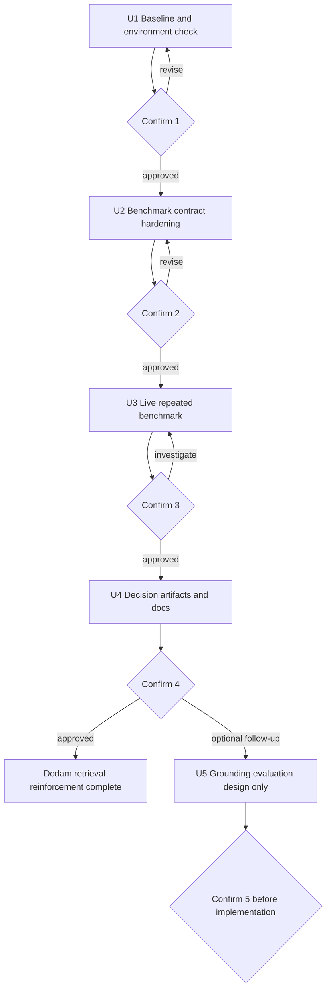

# test: Strengthen Dodam retrieval evidence

## Summary

Dodam의 검색 품질 주장을 실제 반복 벤치마크와 재현 가능한 산출물로 확정한다. 작업은 승인 단위로 나누며, 각 단위가 끝날 때 결과와 트레이드오프를 보고하고 명시적 승인 전에는 다음 단위로 넘어가지 않는다.

현재 저장소에는 50문항 골드셋, SQL keyword/vector/hybrid/adaptive 비교, fallback 사례 분류, 검색 근거 correctness, 반복 실행 옵션이 이미 있다. 따라서 기존 평가 체계를 다시 만들지 않고, fixture로 남은 반복 latency를 실제 DB 및 임베딩 API 실행 결과로 교체하는 일을 우선한다.

---

## Working Agreement

이 문서를 읽고 작업하는 사람 또는 에이전트는 다음 규칙을 지킨다.

1. 한 번에 하나의 승인 단위만 수행한다.
2. 승인 단위에 적힌 허용 범위 밖의 파일은 수정하지 않는다.
3. 작업 중 범위 확대가 필요하면 구현하지 말고 이유와 선택지를 먼저 보고한다.
4. 각 승인 단위가 끝나면 `Confirmation Report` 형식으로 결과를 보고하고 멈춘다.
5. 사용자가 `승인`, `진행`, 또는 다음 승인 단위를 명시하기 전에는 다음 작업을 시작하지 않는다.
6. 실제 실행에 실패했으면 fixture나 과거 수치로 성공을 대신하지 않는다.
7. 검색 평가와 생성 답변 평가는 분리한다. `retrieved_evidence_correctness`를 답변 faithfulness로 표현하지 않는다.
8. 기존 benchmark 파일을 보존한다. 새 실행은 별도 출력 파일에 저장하고, 채택 승인을 받은 뒤에만 대표 문서를 갱신한다.
9. API key, DB URL, 사용자 정보 등 비밀값은 로그, 문서, JSON 산출물에 기록하지 않는다.
10. 팀 구현, 개인 후속 평가, 아직 실행하지 않은 계획을 결과 보고에서 구분한다.

처음 이 문서를 읽었다면 U1만 수행한다. U1 결과를 보고하기 전에는 U2의 코드 변경을 시작하지 않는다.

---

## Current Baseline

작업 시작 시 아래 항목을 현재 저장소에서 다시 확인한다. 이 목록은 2026-08-15 기준 관찰값이며, 현재 상태를 대신하지 않는다.

- 검색 진입점: `app/ai/retrievers/policy_retriever.py`
- 평가 실행기: `tests/eval/retrieval_eval.py`
- 골드셋: `tests/eval/retrieval_cases.jsonl`
- 평가 단위 테스트: `tests/eval/test_retrieval_eval.py`
- 포트폴리오 근거 생성기: `tests/eval/retrieval_portfolio_evidence.py`
- 근거 생성기 테스트: `tests/eval/test_retrieval_portfolio_evidence.py`
- 단일 실행 결과: `output/retrieval_benchmark_50.json`
- 정책 범위 실행 결과: `output/retrieval_benchmark_scoped_50.json`
- 반복 latency 현황: `output/retrieval_latency_repeated.json`은 실제 반복 실행이 아닌 fixture이며 `actual_repeated_run_available=false`로 표시돼 있다.
- 대표 설명 문서: `docs/RETRIEVAL_BENCHMARK.md`, `docs/PORTFOLIO_RETRIEVAL_EVIDENCE.md`, `docs/RESUME_RETRIEVAL_EVALUATION.md`

현재 문서화된 단일 실행 결과는 다음과 같다. 이 수치는 실제 반복 실행으로 재검증하기 전까지 과거 기준선이다.

| 조건 | 전략 | Policy Hit@5 | Section Hit@5 | p50 | p95 | Fallback |
|---|---|---:|---:|---:|---:|---:|
| Broad | Vector | 86.0% | 80.0% | 782ms | 1,093ms | - |
| Broad | Hybrid | 88.0% | 80.0% | 1,292ms | 1,717ms | - |
| Broad | Adaptive | 86.0% | 80.0% | 809ms | 2,290ms | 14.0% |
| Scoped | Vector | 100.0% | 98.0% | 665ms | 1,027ms | - |
| Scoped | Adaptive | 100.0% | 98.0% | 700ms | 951ms | 2.0% |

---

## Requirements

### Measurement Integrity

- R1. 실제 반복 실행과 fixture 기반 산출물을 JSON 필드와 문서 표현에서 명확히 구분한다.
- R2. 반복 벤치마크는 동일한 골드셋, `top_k=5`, 전략 목록, 실행 횟수, warm-up 횟수를 기록한다.
- R3. 각 전략의 실행별 Policy Hit@5, Section Hit@5, MRR, p50, p95, error rate, fallback 정보를 보존한다.
- R4. 대표 latency는 실행별 p50/p95의 중앙값으로 요약하되 실행별 값도 삭제하지 않는다.
- R5. 검색 결과의 정확도 회귀와 latency 변동을 분리해 해석한다.

### Approval Control

- R6. 승인 단위 종료 시 변경 파일, 검증 결과, 수치, 트레이드오프, 한계, 다음 범위를 보고한다.
- R7. 에러 발생, 골드셋 변경, 예상하지 못한 정확도 변화가 있으면 문서 갱신 전에 멈춘다.
- R8. 승인받지 않은 생성 품질 평가, API 응답 계약 변경, 리트리버 튜닝은 수행하지 않는다.

### Portfolio Claims

- R9. 실제 반복 실행이 성공한 수치만 반복 benchmark 결과로 승격한다.
- R10. 내부 50문항 검색 검증셋이라는 범위와 외부 표준 벤치마크가 아니라는 한계를 유지한다.
- R11. 검색된 근거의 적중 여부와 생성 답변의 faithfulness를 같은 지표로 합치지 않는다.
- R12. Hybrid와 Adaptive의 선택은 정확도, latency, fallback 호출 비용을 함께 보고 결정한다.

---

## Scope Boundaries

### In Scope

- 반복 벤치마크 출력 계약 보강
- warm-up을 제외한 실제 5회 측정
- Broad 4전략 및 Scoped 2전략 결과 생성
- 반복 결과 기반 전략 선택 근거 갱신
- 승인된 수치의 검색 평가 및 포트폴리오 문서 반영
- 별도 승인 후 수행하는 소규모 생성 근거 연결 평가 설계

### Deferred Until Separate Approval

- 생성 답변과 evidence chunk의 연결 방식 변경
- `evidence` 문자열을 chunk ID 또는 source object로 바꾸는 API 계약 변경
- LLM judge 도입
- 골드셋 확대 또는 외부 평가자 일치도 측정
- 검색 전략 파라미터 재튜닝

### Out of Scope

- LangGraph 노드 추가
- 챗봇 전체 대화 품질 평가
- 프론트엔드 변경
- 운영 SLA 선언
- 공개 표준 벤치마크라는 표현
- 새 vector database 또는 검색 프레임워크 도입

---

## High-Level Flow



---

## Key Technical Decisions

- KTD1. **실측 전에 측정 계약부터 고정한다:** 현재 반복 실행 옵션은 있지만 warm-up과 실제 실행 provenance가 출력 계약에 충분히 드러나지 않는다. 비용이 큰 5회 실행 전에 이를 테스트로 잠근다.
- KTD2. **Broad와 Scoped를 별도 산출물로 유지한다:** Broad는 정책 발견 능력, Scoped는 이미 선택된 정책 안에서 근거 섹션을 찾는 능력을 본다. 두 조건의 수치를 합치지 않는다.
- KTD3. **대표값과 원시 실행값을 함께 보존한다:** 중앙값만 남기면 변동성과 이상치를 검토할 수 없다. 요약값은 비교에 쓰고 실행별 값은 감사 근거로 남긴다.
- KTD4. **정확도 회귀는 자동 튜닝의 신호가 아니라 중단 신호다:** 반복 실행에서 과거 기준선과 차이가 나면 데이터, DB 상태, 코드, 모델 설정을 먼저 확인한다.
- KTD5. **생성 근거 연결 평가는 별도 결정으로 둔다:** 현재 API는 사용자 친화적인 evidence 문자열을 반환하며 chunk ID 직접 인용 계약이 아니다. 이를 강화하면 소비자 계약에 영향이 있으므로 검색 보강과 한 작업으로 묶지 않는다.

---

## Implementation Units

### U1. Baseline and environment check

- **Goal:** 코드 수정 없이 실제 반복 실행이 가능한 상태와 현재 기준선을 확정한다.
- **Allowed changes:** 없음. 환경 파일이나 benchmark JSON을 수정하지 않는다.
- **Inspect:** `README.md`, `.env.example`, `requirements.txt`, `tests/eval/retrieval_eval.py`, 기존 `output/retrieval_benchmark_*.json`.
- **Actions:**
  - 현재 브랜치, HEAD, 작업 트리 상태를 기록한다.
  - Python 3.12 가상환경과 필수 패키지 사용 가능 여부를 확인한다.
  - DB 연결과 임베딩 API 설정 여부를 값 노출 없이 확인한다.
  - 3개 case와 `vector` 전략으로 smoke benchmark를 수행한다. 결과는 임시 경로에 두며 대표 산출물을 덮어쓰지 않는다.
  - 평가 단위 테스트를 실행해 현재 계약이 통과하는지 확인한다.
- **Verification:**
  - `tests/eval/test_retrieval_eval.py`
  - `tests/eval/test_retrieval_portfolio_evidence.py`
  - smoke benchmark 3문항 완료, error rate 0%
- **Commands:**

  ```bash
  PYTHONPATH=. .venv/bin/pytest -q \
    tests/eval/test_retrieval_eval.py \
    tests/eval/test_retrieval_portfolio_evidence.py

  PYTHONPATH=. .venv/bin/python tests/eval/retrieval_eval.py \
    --strategies vector \
    --ids R001 R002 R003 \
    --top-k 5 \
    --output /tmp/dodam-retrieval-smoke.json
  ```

  `.venv`가 없으면 임의로 새 dependency 환경을 만들지 말고 U1 보고에서 중단 사유와 저장소의 실제 Python 실행 경로를 제시한다.
- **Stop conditions:**
  - DB 또는 임베딩 API에 연결할 수 없음
  - 골드셋이 50문항이 아니거나 policy ID 구성이 달라짐
  - 기존 평가 테스트 실패
  - smoke benchmark에 에러 발생
- **Confirmation 1 report focus:** 환경 준비 여부, 실제 실행 비용이 발생하는 외부 호출 범위, 현재 실패 요인, U2 진행 가능 여부.

### U2. Benchmark contract hardening

- **Depends on:** Confirmation 1 approval.
- **Goal:** warm-up과 실제 반복 실행 여부가 산출물에서 모호하지 않도록 평가 출력 계약을 보강한다. 실제 5회 전체 평가는 아직 실행하지 않는다.
- **Files:**
  - `tests/eval/retrieval_eval.py`
  - `tests/eval/test_retrieval_eval.py`
  - `docs/RETRIEVAL_BENCHMARK.md`
- **Approach:**
  - warm-up 횟수를 명시할 수 있는 입력을 추가하고 warm-up 결과는 집계 대상에서 제외한다.
  - 반복 결과에 `execution_mode`, `run_count`, `warmup_run_count`, 검색 조건을 기록한다.
  - 실행별 metric 배열과 중앙값 요약을 계속 보존한다.
  - 비밀값, 전체 환경 변수, DB 접속 문자열은 provenance에 넣지 않는다.
  - `repeat_runs=1`, 잘못된 횟수, warm-up 포함/제외 동작을 테스트한다.
- **Test Scenarios:**
  1. warm-up 1회와 측정 3회를 요청하면 검색은 총 4회 실행되지만 요약의 `run_count`는 3이다.
  2. `warmup_run_count`는 출력에 남고 warm-up latency는 대표값 계산에 포함되지 않는다.
  3. 2회 이상 실행 결과에는 실행별 p50/p95 배열과 중앙값이 함께 존재한다.
  4. 1회 실행의 기존 결과 shape는 기존 소비자가 읽을 수 있도록 유지하거나 변경점을 문서화한다.
  5. 음수 warm-up 또는 0 이하 repeat 횟수는 명확한 오류로 종료한다.
- **Verification:** 관련 pytest 전체 통과, 3문항 fake 또는 smoke run으로 JSON schema 확인.
- **Tradeoff to report:** 출력 schema 하위 호환성을 유지할지, 반복 실행 결과에만 새 metadata를 둘지. 구현 결과와 소비자 영향을 함께 보고한다.
- **Stop conditions:** 기존 benchmark reader나 근거 생성기가 깨짐, 실제 실행과 fixture를 구분할 수 없음, 테스트 없이 CLI 동작만 추가됨.
- **Confirmation 2 report focus:** 변경된 출력 예시, 하위 호환성, 테스트 결과, 전체 실행 예상 호출량과 시간, U3 명령과 출력 경로.

### U3. Live repeated benchmark

- **Depends on:** Confirmation 2 approval.
- **Goal:** fixture가 아닌 실제 반복 benchmark를 Broad와 Scoped 조건에서 생성한다.
- **Allowed changes:** 결과 JSON만 생성한다. 리트리버 로직, 골드셋, 평가 계산식, 대표 문서는 수정하지 않는다.
- **Outputs:**
  - `output/retrieval_benchmark_repeated_broad_5.json`
  - `output/retrieval_benchmark_repeated_scoped_5.json`
- **Run Contract:**
  - 골드셋 50문항
  - `top_k=5`
  - warm-up 1회, 측정 5회
  - Broad: `sql_keyword`, `vector`, `hybrid`, `adaptive`
  - Scoped: `vector`, `adaptive`
  - 전략 실행 순서는 결과에 기록하거나 보고서에 명시한다.
- **Commands after U2 approval:** U2에서 확정한 warm-up flag 이름이 `--warmup-runs`인 경우 아래 명령을 사용한다. 실제 flag가 다르면 Confirmation 2에서 확정한 명령을 우선한다.

  ```bash
  PYTHONPATH=. .venv/bin/python tests/eval/retrieval_eval.py \
    --strategies sql_keyword vector hybrid adaptive \
    --warmup-runs 1 \
    --repeat-runs 5 \
    --top-k 5 \
    --output output/retrieval_benchmark_repeated_broad_5.json

  PYTHONPATH=. .venv/bin/python tests/eval/retrieval_eval.py \
    --strategies vector adaptive \
    --scope-to-expected-policy \
    --warmup-runs 1 \
    --repeat-runs 5 \
    --top-k 5 \
    --output output/retrieval_benchmark_repeated_scoped_5.json
  ```
- **Acceptance Criteria:**
  - 두 실행 모두 측정 5회를 완주한다.
  - error rate가 모든 전략에서 0%다.
  - JSON에 실행별 metric과 중앙값 요약이 모두 존재한다.
  - Adaptive fallback count/rate가 실행별로 보존된다.
  - 기존 단일 실행 결과 파일은 변경되지 않는다.
- **Regression Alert:** 다음 항목은 실패로 단정하지 않고 조사 필요 상태로 보고한 뒤 멈춘다.
  - Policy Hit@5 또는 Section Hit@5가 과거 기준선과 2%p 초과 차이
  - 같은 코드와 데이터에서 실행별 정확도 값이 달라짐
  - error rate가 0%보다 큼
  - 특정 실행의 p95가 중앙 p95의 2배를 초과
  - fallback rate가 실행별로 달라짐
- **Confirmation 3 report focus:**
  - 전략별 정확도와 실행별 p50/p95
  - median, min, max와 이상치
  - fallback 횟수와 실패 case
  - 과거 단일 실행 대비 차이
  - Hybrid의 소폭 정확도 이득과 추가 latency
  - Adaptive의 조건부 SQL 호출 절감과 tail latency 비용
  - 결과를 대표 수치로 채택할지, 재실행 또는 원인 조사가 필요한지

### U4. Decision artifacts and documentation

- **Depends on:** Confirmation 3에서 실측 결과 채택 승인.
- **Goal:** 승인된 실측값만 자동 산출물과 대표 문서에 반영하고, 포트폴리오에서 사용할 수 있는 제한된 결론을 만든다.
- **Files:**
  - `tests/eval/retrieval_portfolio_evidence.py`
  - `tests/eval/test_retrieval_portfolio_evidence.py`
  - `output/retrieval_latency_repeated.json`
  - `output/retrieval_strategy_decision_summary.json`
  - `docs/RETRIEVAL_BENCHMARK.md`
  - `docs/PORTFOLIO_RETRIEVAL_EVIDENCE.md`
  - `docs/RESUME_RETRIEVAL_EVALUATION.md`
- **Approach:**
  - 반복 Broad/Scoped 결과를 읽어 대표 latency, 변동 범위, 정확도 안정성, fallback 안정성을 계산한다.
  - `output/retrieval_latency_repeated.json`을 실제 실행 provenance가 있는 산출물로 재생성한다.
  - 전략 판단 문장은 수치에서 생성하되, `현재 50문항 내부 평가 조건`이라는 범위를 유지한다.
  - 단일 실행 표와 반복 실행 표를 구분하고, 과거 수치가 새 수치처럼 보이지 않게 한다.
  - 포트폴리오용 문장은 SLA, 공개 benchmark, 생성 faithfulness를 주장하지 않는다.
- **Test Scenarios:**
  1. 실제 반복 파일이 없거나 `run_count < 3`이면 대표 반복 수치 생성을 거부한다.
  2. Broad와 Scoped 결과가 뒤바뀌면 검증 오류가 발생한다.
  3. 전략 또는 metric이 누락되면 조용히 0으로 채우지 않고 실패한다.
  4. 생성된 문서 수치가 JSON source와 일치한다.
  5. `actual_repeated_run_available=true`는 실제 반복 입력을 사용한 경우에만 기록된다.
- **Verification:** 관련 pytest, 산출물 재생성, JSON과 Markdown 수치 대조.
- **Tradeoff to report:** Hybrid를 정확도 우선 선택지로 남길지, Adaptive를 기본 후보로 유지할지. 판단은 accuracy gain, p50/p95 증가, fallback 비율을 함께 제시한다.
- **Confirmation 4 report focus:** 최종 수치, 변경 전후 문장, 채택한 전략 판단, 포트폴리오에서 말할 수 있는 것과 말할 수 없는 것.

### U5. Generated grounding evaluation design

- **Depends on:** Confirmation 4 완료 후 사용자가 별도 진행 승인.
- **Goal:** 구현 전에 생성 답변이 실제 evidence chunk와 연결됐다고 검증할 최소 계약을 선택한다.
- **Allowed changes:** 설계 문서 하나만 작성한다. API, schema, agent, frontend는 수정하지 않는다.
- **Inspect:**
  - `app/ai/graphs/policy_summary_graph.py`
  - `app/ai/agents/policy_summary_agent.py`
  - `app/schemas/ai_contract.py`
  - `app/schemas/policy_summary_schema.py`
  - `app/services/policy_summary_service.py`
- **Options to compare:**
  - **A. 샘플 수동 rubric:** 10개 정책 요약의 각 문장을 policy field 또는 retrieved chunk에 사람이 매핑한다. 구현 비용이 낮지만 자동 회귀 검출력이 낮다.
  - **B. 구조화 citation:** 생성 결과가 chunk ID 또는 source reference를 반환하게 한다. 근거 추적은 가장 강하지만 API와 저장 schema 및 소비자 영향이 크다.
  - **C. 문자열 overlap/규칙 검사:** 자동화는 쉽지만 한국어 paraphrase에서 거짓 실패와 거짓 통과 가능성이 높다.
  - **D. LLM judge:** 의미 비교는 가능하지만 비용, 변동성, 자기평가 편향이 생기며 현재 보강 우선순위에는 권장하지 않는다.
- **Required report:** 각 선택지의 변경 범위, 신뢰도, 비용, 소비자 영향, 포트폴리오 가치와 권장안을 보고한다.
- **Stop condition:** 사용자가 평가 방식과 허용되는 계약 변경 범위를 승인하기 전에는 구현하지 않는다.

---

## Confirmation Report

각 승인 단위 종료 시 아래 형식을 그대로 사용한다.

```markdown
## Dodam Confirmation N

### Result
- 상태: 완료 / 부분 완료 / 중단
- 이번 범위: Ux 이름
- 핵심 결과: 한두 문장

### Changes
- 변경 파일: 파일별 변경 목적
- 생성 산출물: 경로와 실제/fixture 여부
- 범위 밖 변경: 없음 또는 사유

### Verification
- 실행한 테스트와 결과
- 실행한 benchmark 조건
- 실패하거나 실행하지 못한 검증

### Metrics
- accuracy: Policy Hit@5, Section Hit@5, MRR
- latency: 실행별 p50/p95와 대표값
- reliability: error rate, fallback count/rate
- 기준선 대비 차이

### Tradeoffs
- 얻은 이점
- 증가한 latency, 외부 호출, 복잡도 또는 유지비
- 선택하지 않은 대안과 이유

### Limits and Risks
- 내부 골드셋 범위
- 재현 조건
- 아직 측정하지 않은 항목
- 포트폴리오에서 주장하면 안 되는 내용

### Proposed Next Scope
- 다음 승인 단위
- 허용 파일
- 예상 결과
- 중단 조건

### Confirmation Request
다음 승인 단위로 진행할지, 현재 결과를 수정 또는 재검증할지 확인 요청
```

---

## Verification Matrix

| Requirement | Verified by |
|---|---|
| R1, R2 | U2 output metadata tests |
| R3, R4 | U2 repeated summary tests, U3 JSON inspection |
| R5 | U3 comparison report |
| R6, R7 | Every confirmation report and stop condition |
| R8 | Git diff scope check at each gate |
| R9, R10 | U4 artifact generation tests and docs review |
| R11 | Terminology checks in U4 docs |
| R12 | U3 metrics report and U4 decision summary |

---

## Risks and Dependencies

- 실제 실행은 PostgreSQL 데이터와 OpenAI embedding API에 의존한다. 네트워크와 DB 부하가 latency에 영향을 준다.
- 전략을 순차 실행하므로 뒤에 실행된 전략이 cache 또는 부하의 영향을 받을 수 있다. 실행 순서를 기록하고 절대 latency를 운영 SLA로 해석하지 않는다.
- 반복 실행은 외부 API 호출량과 실행 시간을 늘린다. U1 smoke 결과로 예상 범위를 보고한 뒤 승인받는다.
- DB 데이터, embedding model, chunk 데이터가 과거 benchmark 이후 바뀌었다면 정확도 차이는 코드 회귀가 아닐 수 있다. 이 경우 provenance 확인을 먼저 한다.
- 현재 evidence API는 사용자 친화적 문자열 중심이다. chunk-level citation으로 강화하면 backend contract와 consumer 변경이 필요하다.

---

## Completion Criteria

Dodam 검색 보강은 다음 조건을 모두 만족할 때 완료로 본다.

- Broad와 Scoped 실제 5회 반복 결과가 별도 JSON으로 보존돼 있다.
- 반복 산출물이 fixture와 구분되고 실행 조건을 포함한다.
- error, 정확도 변동, latency 이상치가 보고돼 있다.
- 대표 문서의 수치가 승인된 JSON과 일치한다.
- Adaptive 또는 다른 전략을 선택한 이유가 정확도, latency, fallback 트레이드오프로 설명된다.
- 내부 50문항 검색 검증셋, 비-SLA, 비-faithfulness 한계가 유지된다.
- 각 승인 단위의 Confirmation Report가 남아 있다.

생성 근거 연결 평가는 U5 설계 승인 이후의 별도 작업이며, 이를 수행하지 않아도 검색 보강 완료 조건에는 영향을 주지 않는다.
